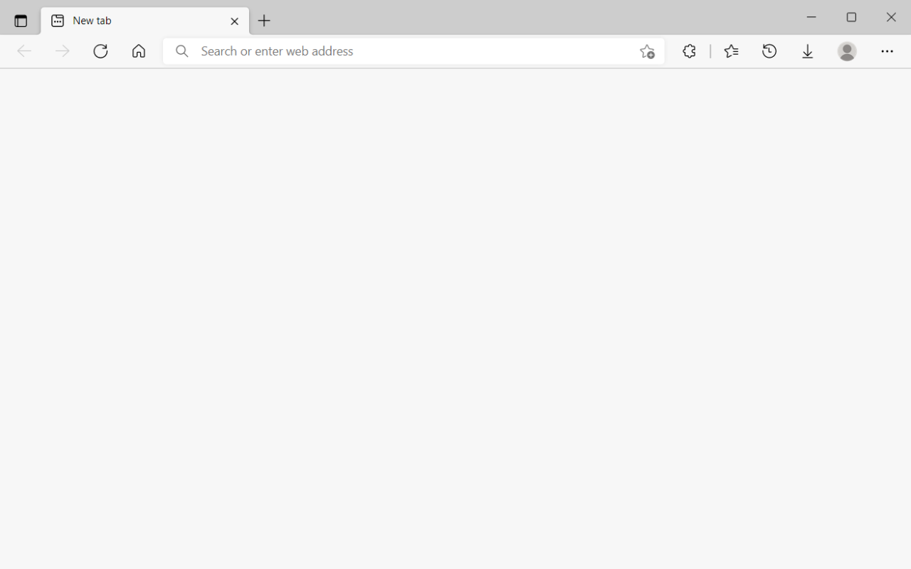
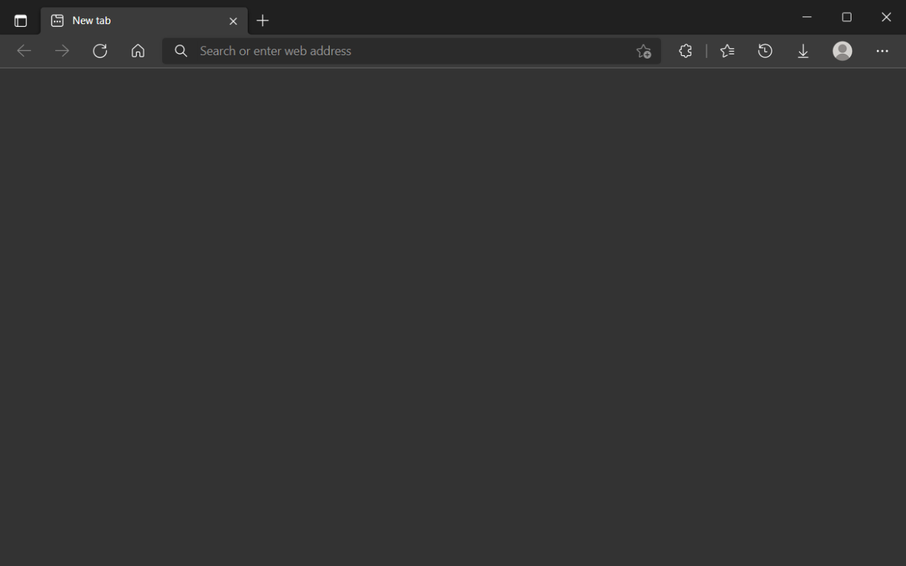

# Blank New Tab

Replace your Edge New tab page with a blank one.

 

## 🎀 Screenshots

| Light theme | Dark theme |
|:-:|:-:|
|  |  |

## 🪶 Description

Blank New Tab is a simple browser extension for Edge/Chromium that replaces your New tab page with a blank one.

I made it for my own use, because Edge's default New tab page annoyed me in many aspects. Similar extensions I tried had a different favicon or an untranslated page title. So I ended up making this.

[Get it on Edge Add-ons](https://microsoftedge.microsoft.com/addons/detail/blank-new-tab/pfbmpcgfjncjakgfpddijlbdpjnhnfem)

## 💚 Features

- Blank New tab page
- Light & dark theme support
- Colors as in the built-in Edge Settings pages
- Default Edge New tab icon and page title
- Localized page title ([see available languages](TRANSLATIONS))

## 📝 Notes

- Edge disables Blank New Tab on install. Enable it in the Manage Extensions page (edge://extensions).
- To install in a different Chromium-based browser:
  - Download the contents of this repo.
  - Enable Developer mode in your browser's Manage Extensions page.
  - Select "Load unpacked" and choose the `src` folder.
- New tab icon comes from Microsoft [Fluent UI System Icons](https://github.com/microsoft/fluentui-system-icons) (MIT license).
- Extensions can't override the InPrivate/Incognito New tab page.
- New tab page title displays in browser's UI language ([see available languages](TRANSLATIONS)). Edge Add-ons listing states there's only 1 available language because the extension's description is only in English.
